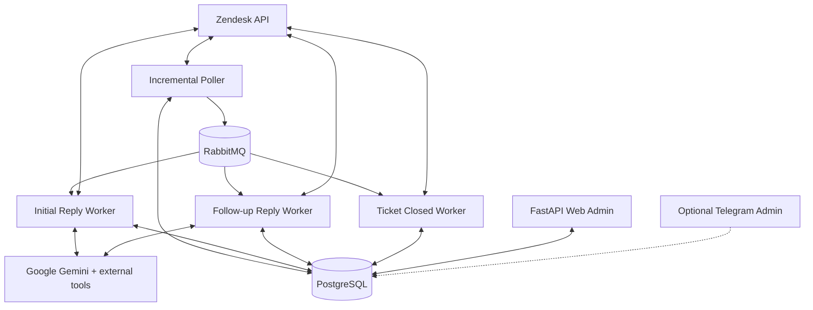

# AI Customer Support Assistant

**Event-driven AI automation for Zendesk customer support.**

This project automates first-line customer-support workflows around Zendesk. It polls ticket updates, classifies incoming requests, generates AI-assisted replies, processes work asynchronously through RabbitMQ, and gives operators runtime control through a web administration interface.

The system is designed around production concerns: retries, dead-letter queues, deduplication, persistent state, runtime configuration, secret-safe logging, and separation between customer-facing automation and administrative controls.

## What the system does

```text
Zendesk
  ↓
Incremental poller
  ↓
Event / job creation
  ↓
RabbitMQ
  ↓
Reply workers
  ↓
LLM + external tools
  ↓
Reply validation
  ↓
Zendesk comment
```

The application handles different ticket events through dedicated workers:

- new ticket → initial reply workflow
- new customer comment → follow-up reply workflow
- solved/closed ticket → closing workflow

Reply generation can operate in either **internal-note** or **public-comment** mode without requiring a redeploy.

## Key features

- Zendesk incremental polling with checkpointing
- Distributed locking for polling
- RabbitMQ queues with retries and dead-letter handling
- Separate initial-reply, follow-up, and ticket-closed workers
- Rule-based and LLM-assisted service/spam filtering
- AI-generated first and follow-up replies
- Reply deduplication before posting to Zendesk
- Runtime LLM settings stored in PostgreSQL
- Runtime prompt management
- Web Admin for production operations
- Optional Telegram administration interface
- Ticket history and reply-attempt inspection
- LLM playground isolated from production ticket data
- Role-based Web Admin access
- Structured JSON logging with context and secret redaction
- Docker-based development and deployment

## Architecture



The core application and Web Admin run as separate processes. This keeps operational UI concerns isolated from the asynchronous ticket-processing pipeline.

## End-to-end flow

1. The poller reads updated tickets from Zendesk.
2. Ticket changes are converted into typed jobs.
3. Jobs are published to RabbitMQ.
4. A worker validates the current ticket state.
5. Service/spam filtering decides whether the ticket should be handled.
6. The reply pipeline builds the LLM context and generates a response.
7. Runtime settings determine whether the result is posted as an internal note or public reply.
8. The application records reply attempts and prevents duplicate posting.
9. Failures follow retry/dead-letter behavior rather than being silently dropped.

## Web Admin

The FastAPI-based Web Admin provides operational control without requiring a deployment.

Main sections include:

- **Zendesk mode** — switch generated comments between internal and public
- **Tickets** — inspect observed ticket state and conversation history
- **Replies** — review generated, posted, and failed reply attempts
- **Playground** — test prompts and runtime settings outside production tickets
- **LLM Settings** — manage response/classification parameters
- **Prompts** — inspect, export, and edit prompts
- **Users** — manage administrative users

Administrative roles:

| Role | Access |
|---|---|
| `user` | read-only operational pages |
| `admin` | runtime settings, prompts, Zendesk mode, Playground |
| `superadmin` | full access including user management |

## LLM playground

The Playground is deliberately separated from production ticket data.

It stores its own:

- tickets
- messages
- generation runs

This allows prompt and model behavior to be tested without creating or modifying real Zendesk conversations.

## Reliability and operational design

### Queue resilience

RabbitMQ provides durable asynchronous processing with retry queues and dead-letter handling, allowing temporary failures in Zendesk, LLM, or downstream services to be retried safely.

### Runtime configuration

LLM parameters, prompts, and Zendesk reply mode are stored outside application code. Operators can change behavior without rebuilding or restarting the main service.

### Observability

Structured logs include request/job context while sensitive values are redacted. Reply attempts are persisted so failed generations and posting errors can be inspected through the admin UI.

## Tech stack

| Area | Technologies |
|---|---|
| Runtime | Python 3.13, anyio |
| HTTP / integrations | httpx |
| Messaging | RabbitMQ, aio-pika |
| Database | PostgreSQL, SQLAlchemy, asyncpg, Alembic |
| Web Admin | FastAPI, server-rendered templates |
| LLM | Google Gemini |
| Admin bot | aiogram |
| Configuration | Pydantic, pydantic-settings |
| Deployment | Docker, Docker Compose |

## Repository layout

```text
src/
├── app.py             # application orchestration
├── zendesk/           # polling and Zendesk integration
├── workers/           # asynchronous job consumers
├── jobs/              # queue contracts and topology
├── db/                # models and repositories
├── ai/                # prompts, LLM settings and tools
├── telegram/          # optional admin bot
└── web_admin/         # FastAPI administration UI

deploy/                # Docker and environment templates
run.py                 # main service
run_web.py             # Web Admin
```

## Local development

### Requirements

- Python 3.13
- `uv`
- Docker / Docker Compose

### Setup

```bash
uv sync
```

Prepare the environment file, then start PostgreSQL and RabbitMQ using the Docker configuration in `deploy/`.

Apply migrations:

```bash
uv run alembic upgrade head
```

Run the processing service:

```bash
uv run python run.py
```

Run Web Admin separately:

```bash
uv run python run_web.py
```

## Current scope

- Google Gemini is the active LLM provider.
- The current runtime setup targets one production brand.
- Per-run model/provider overrides are not part of the first Playground version.
- `AgentDirectiveWorker` exists as a future extension and is not enabled in normal startup.

## Planned improvements

- Broader automated test coverage, including external API contract tests
- Metrics, health endpoints, and dashboards
- Per-run model override in the Playground
- Additional brand/provider runtime controls
- Completion of the agent-directive workflow

## Project focus

This project demonstrates integration-heavy backend engineering: asynchronous job processing, LLM orchestration, external APIs, durable messaging, runtime administration, and failure-aware production workflows.
